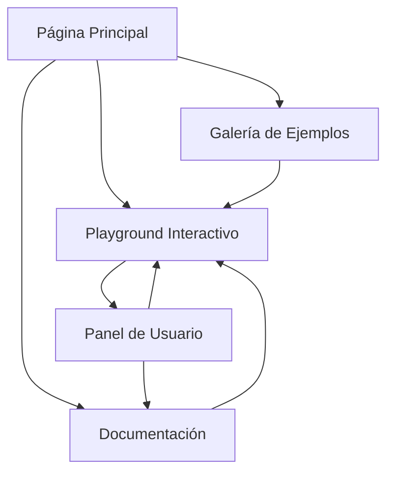

## 1. Product Overview
Reactor es una plataforma web moderna inspirada en React que simplifica el uso de Vulkan API para desarrolladores gráficos. El producto abstrae la complejidad de Vulkan puro proporcionando una interfaz intuitiva y herramientas visuales para crear aplicaciones gráficas de alto rendimiento.

Dirigido a desarrolladores gráficos, programadores de videojuegos y entusiastas de gráficos por computadora que buscan aprovechar el poder de Vulkan sin sumergirse en su complejidad técnica.

## 2. Core Features

### 2.1 User Roles
| Rol | Método de Registro | Permisos Principales |
|------|---------------------|------------------|
| Usuario Desarrollador | Registro por email | Acceso a playground, documentación, ejemplos |
| Usuario Premium | Actualización por suscripción | Acceso a tutoriales avanzados, plantillas exclusivas, soporte prioritario |
| Visitante | Sin registro | Acceso limitado a documentación básica |

### 2.2 Feature Module
Nuestra plataforma Reactor consiste en las siguientes páginas principales:
1. **Página Principal**: Hero section con reactor nuclear animado, navegación principal, características destacadas.
2. **Playground Interactivo**: Editor de código en tiempo real, visualización 3D, panel de controles Vulkan.
3. **Documentación**: Guías paso a paso, referencia de API, ejemplos prácticos.
4. **Galería de Ejemplos**: Demos interactivos, código fuente, tutoriales.
5. **Panel de Usuario**: Perfil personal, proyectos guardados, configuración.

### 2.3 Page Details
| Page Name | Module Name | Feature description |
|-----------|-------------|---------------------|
| Página Principal | Hero Reactor Section | Mostrar animación 3D del reactor nuclear con efectos de brillo, incluir logo Vulkan en el núcleo, texto REACTOR con efecto glow nuclear. |
| Página Principal | Características | Presentar tarjetas con iconos de características principales: simplificación de Vulkan, rendimiento, compatibilidad multiplataforma. |
| Página Principal | Navegación | Barra superior con logo, menú principal, botones de login/registro, diseño sticky al hacer scroll. |
| Playground Interactivo | Editor de Código | Editor de código con sintaxis highlighting para GLSL/HLSL, autocompletado para funciones Vulkan, guardado automático. |
| Playground Interactivo | Visualizador 3D | Canvas WebGL/Three.js para renderizar resultados, controles de cámara orbitales, opciones de wireframe/sólido. |
| Playground Interactivo | Panel Vulkan | Controles deslizantes para parámetros de renderizado, selector de shaders, configuración de pipelines. |
| Documentación | Guías | Navegación jerárquica por categorías, búsqueda en tiempo real, ejemplos de código ejecutables. |
| Documentación | Referencia API | Lista de funciones Vulkan simplificadas, parámetros y tipos de retorno, ejemplos de uso. |
| Galería de Ejemplos | Demos Interactivos | Miniaturas de proyectos, vista previa al hover, botón para abrir en playground. |
| Panel de Usuario | Gestión de Proyectos | Lista de proyectos guardados, crear/editar/eliminar proyectos, exportar código. |
| Panel de Usuario | Perfil | Información personal, estadísticas de uso, preferencias de tema (claro/oscuro). |

## 3. Core Process
**Flujo del Usuario Principal:**
1. Usuario llega a la página principal y ve la animación del reactor nuclear
2. Explora las características y decide registrarse
3. Accede al playground interactivo para experimentar con Vulkan
4. Guarda sus proyectos y accede a la documentación
5. Comparte sus creaciones en la galería

**Flujo de Desarrollador Experto:**
1. Accede directamente al playground desde la navegación
2. Carga plantillas existentes o crea nuevo proyecto
3. Utiliza el editor con autocompletado para escribir shaders
4. Visualiza resultados en tiempo real en el canvas 3D
5. Exporta el código generado para su proyecto personal

## 4. User Interface Design
### 4.1 Design Style
- **Colores Primarios**: Verde nuclear (#76b900, #8bc34a, #aeea00) como en el SVG
- **Colores Secundarios**: Verde oscuro (#1e3a24, #2e5036, #3a5f42) para elementos metálicos
- **Colores de Fondo**: Gradiente oscuro (#0f1a12, #0b140f, #08120a) para ambiente tecnológico
- **Estilo de Botones**: Bordes redondeados con efecto hover glow, estilo 3D sutil
- **Tipografía**: Arial Black/Impact para títulos principales, Arial para texto normal
- **Tamaños de Fuente**: 90px para REACTOR, 24px para subtítulos, 16px para contenido
- **Estilo de Layout**: Basado en tarjetas con sombras profundas, navegación superior
- **Iconos**: Estilo lineal minimalista, preferencia por iconos de React y Vulkan

### 4.2 Page Design Overview
| Page Name | Module Name | UI Elements |
|-----------|-------------|-------------|
| Página Principal | Hero Reactor Section | Canvas SVG animado con reactor nuclear, efecto glow nuclear, logo Vulkan triangular en el centro, animación de pulso para el núcleo. |
| Página Principal | Características | Grid de 3 tarjetas con iconos, fondo con gradiente sutil, bordes con brillo metálico, efecto hover con elevación. |
| Playground Interactivo | Editor de Código | Panel dividido con splitter draggable, tema oscuro para el editor, números de línea, resaltado de sintaxis en verde nuclear. |
| Playground Interactivo | Visualizador 3D | Canvas ocupando 60% del espacio, controles orbitales en esquina superior derecha, información de FPS en overlay. |
| Documentación | Guías | Sidebar navegable con árbol de contenidos, área principal con contenido markdown, búsqueda instantánea con highlighting. |

### 4.3 Responsiveness
- **Diseño Desktop-First**: Optimizado para pantallas de 1920x1080 y superiores
- **Adaptación Mobile**: Breakpoints en 768px y 480px, menú hamburguesa para navegación
- **Touch Interaction**: Gestos de swipe para navegación entre demos, pinch-to-zoom en visualizador 3D
- **Performance**: Lazy loading para imágenes y componentes 3D, code splitting por rutas

### 4.4 3D Scene Guidance
- **Ambiente**: Estudio oscuro con iluminación dramática, fondo con gradiente profundo
- **Iluminación**: Key light verde nuclear desde el centro, fill lights ambientales sutiles
- **Cámara**: Perspectiva orbital alrededor del reactor, FOV 60°, controles suaves
- **Composición**: Reactor como elemento central, tubos metálicos laterales, reflejos en superficie
- **Animaciones**: Rotación continua lenta del reactor, pulso del núcleo, partículas flotantes
- **Post-procesamiento**: Bloom para efectos glow, SSAO para profundidad, motion blur sutil