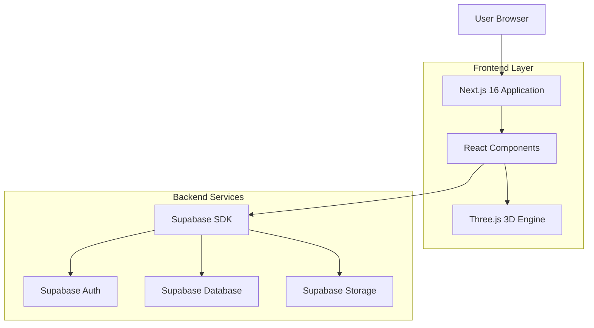
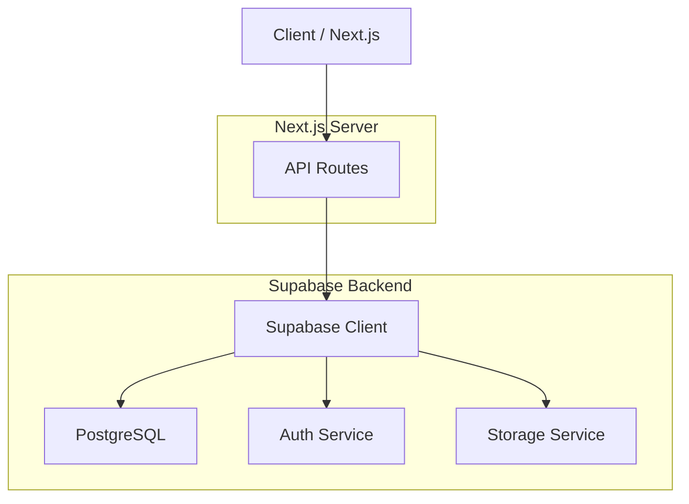
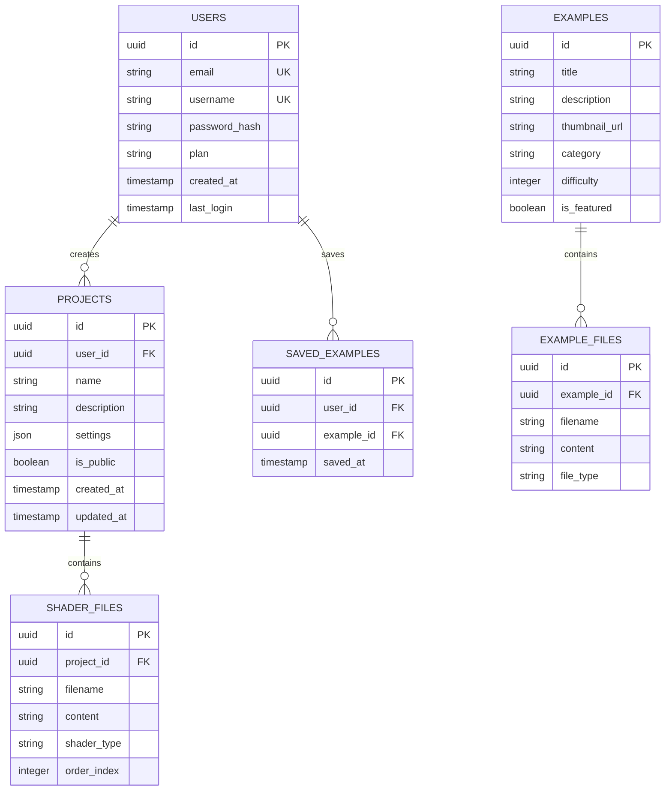

## 1. Architecture design



## 2. Technology Description
- **Frontend**: Next.js 16 + React 18 + TypeScript 5
- **Initialization Tool**: bun-create (Bun package manager)
- **Estilos**: Tailwind CSS 3 + PostCSS
- **3D Engine**: Three.js + @react-three/fiber + @react-three/drei
- **Backend**: Supabase (PostgreSQL, Auth, Storage)
- **Gestión de Estado**: Zustand
- **Editor de Código**: Monaco Editor (VS Code editor)
- **Build Tool**: Bun bundler

## 3. Route definitions
| Route | Purpose |
|-------|---------|
| / | Página principal con hero reactor y características |
| /playground | Editor interactivo con visualizador 3D Vulkan |
| /docs | Documentación y guías de uso |
| /gallery | Galería de ejemplos y demos |
| /profile | Panel de usuario y gestión de proyectos |
| /auth/login | Página de autenticación |
| /auth/register | Página de registro |
| /api/auth/callback | Callback de autenticación Supabase |

## 4. API definitions

### 4.1 Authentication APIs

```
POST /api/auth/login
```

Request:
| Param Name| Param Type | isRequired | Description |
|-----------|-------------|-------------|-------------|
| email | string | true | Email del usuario |
| password | string | true | Contraseña del usuario |

Response:
| Param Name| Param Type | Description |
|-----------|-------------|-------------|
| user | object | Datos del usuario autenticado |
| session | object | Sesión JWT de Supabase |
| error | string | Mensaje de error si existe |

### 4.2 Project Management APIs

```
GET /api/projects
```

Response:
| Param Name| Param Type | Description |
|-----------|-------------|-------------|
| projects | array | Lista de proyectos del usuario |
| count | number | Total de proyectos |

```
POST /api/projects
```

Request:
| Param Name| Param Type | isRequired | Description |
|-----------|-------------|-------------|-------------|
| name | string | true | Nombre del proyecto |
| code | string | true | Código GLSL/Vulkan |
| settings | object | false | Configuraciones del proyecto |

### 4.3 Code Execution APIs

```
POST /api/shaders/compile
```

Request:
| Param Name| Param Type | isRequired | Description |
|-----------|-------------|-------------|
| shaderCode | string | true | Código del shader |
| shaderType | string | true | Tipo: vertex/fragment/compute |
| targetVersion | string | false | Versión de Vulkan objetivo |

Response:
| Param Name| Param Type | Description |
|-----------|-------------|-------------|
| compiled | boolean | Estado de compilación |
| output | string | Resultado o errores |
| warnings | array | Advertencias si existen |

## 5. Server architecture diagram



## 6. Data model

### 6.1 Data model definition


### 6.2 Data Definition Language

**Tabla de Usuarios (users)**
```sql
-- Crear tabla
CREATE TABLE users (
  id UUID PRIMARY KEY DEFAULT gen_random_uuid(),
  email VARCHAR(255) UNIQUE NOT NULL,
  username VARCHAR(50) UNIQUE NOT NULL,
  password_hash VARCHAR(255) NOT NULL,
  plan VARCHAR(20) DEFAULT 'free' CHECK (plan IN ('free', 'premium', 'enterprise')),
  created_at TIMESTAMP WITH TIME ZONE DEFAULT NOW(),
  last_login TIMESTAMP WITH TIME ZONE,
  updated_at TIMESTAMP WITH TIME ZONE DEFAULT NOW()
);

-- Índices
CREATE INDEX idx_users_email ON users(email);
CREATE INDEX idx_users_username ON users(username);
CREATE INDEX idx_users_plan ON users(plan);
```

**Tabla de Proyectos (projects)**
```sql
-- Crear tabla
CREATE TABLE projects (
  id UUID PRIMARY KEY DEFAULT gen_random_uuid(),
  user_id UUID REFERENCES users(id) ON DELETE CASCADE,
  name VARCHAR(100) NOT NULL,
  description TEXT,
  settings JSONB DEFAULT '{}',
  is_public BOOLEAN DEFAULT false,
  created_at TIMESTAMP WITH TIME ZONE DEFAULT NOW(),
  updated_at TIMESTAMP WITH TIME ZONE DEFAULT NOW()
);

-- Índices
CREATE INDEX idx_projects_user_id ON projects(user_id);
CREATE INDEX idx_projects_public ON projects(is_public) WHERE is_public = true;
CREATE INDEX idx_projects_created_at ON projects(created_at DESC);
```

**Tabla de Archivos Shader (shader_files)**
```sql
-- Crear tabla
CREATE TABLE shader_files (
  id UUID PRIMARY KEY DEFAULT gen_random_uuid(),
  project_id UUID REFERENCES projects(id) ON DELETE CASCADE,
  filename VARCHAR(100) NOT NULL,
  content TEXT NOT NULL,
  shader_type VARCHAR(20) CHECK (shader_type IN ('vertex', 'fragment', 'compute', 'geometry')),
  order_index INTEGER DEFAULT 0,
  created_at TIMESTAMP WITH TIME ZONE DEFAULT NOW(),
  updated_at TIMESTAMP WITH TIME ZONE DEFAULT NOW()
);

-- Índices
CREATE INDEX idx_shader_files_project_id ON shader_files(project_id);
CREATE INDEX idx_shader_files_type ON shader_files(shader_type);
```

**Tabla de Ejemplos (examples)**
```sql
-- Crear tabla
CREATE TABLE examples (
  id UUID PRIMARY KEY DEFAULT gen_random_uuid(),
  title VARCHAR(100) NOT NULL,
  description TEXT,
  thumbnail_url VARCHAR(500),
  category VARCHAR(50),
  difficulty INTEGER CHECK (difficulty BETWEEN 1 AND 5),
  is_featured BOOLEAN DEFAULT false,
  created_at TIMESTAMP WITH TIME ZONE DEFAULT NOW()
);

-- Índices
CREATE INDEX idx_examples_category ON examples(category);
CREATE INDEX idx_examples_difficulty ON examples(difficulty);
CREATE INDEX idx_examples_featured ON examples(is_featured) WHERE is_featured = true;
```

**Políticas de Supabase**
```sql
-- Políticas RLS (Row Level Security)
-- Permitir lectura pública de ejemplos
GRANT SELECT ON examples TO anon;
GRANT SELECT ON examples TO authenticated;

-- Permitir lectura de proyectos públicos
GRANT SELECT ON projects TO anon;
GRANT SELECT ON shader_files TO anon;

-- Usuarios autenticados pueden crear proyectos
GRANT ALL ON projects TO authenticated;
GRANT ALL ON shader_files TO authenticated;

-- Políticas de seguridad
ALTER TABLE projects ENABLE ROW LEVEL SECURITY;
ALTER TABLE shader_files ENABLE ROW LEVEL SECURITY;

-- Usuarios solo pueden ver sus propios proyectos
CREATE POLICY "Users can view own projects" ON projects
  FOR SELECT USING (auth.uid() = user_id);

-- Usuarios pueden crear proyectos
CREATE POLICY "Users can create projects" ON projects
  FOR INSERT WITH CHECK (auth.uid() = user_id);

-- Usuarios pueden actualizar sus proyectos
CREATE POLICY "Users can update own projects" ON projects
  FOR UPDATE USING (auth.uid() = user_id);
```

### 6.3 Configuración de Supabase

**Configuración de Autenticación**
```typescript
// supabase/config.toml
[auth]
enabled = true
jwt_expiry = 3600
enable_signup = true

[auth.email]
enabled = true
double_confirm_changes = true
enable_confirmations = true
```

**Storage Buckets**
```sql
-- Crear bucket para proyectos
INSERT INTO storage.buckets (id, name, public) 
VALUES ('projects', 'projects', true);

-- Crear bucket para ejemplos
INSERT INTO storage.buckets (id, name, public) 
VALUES ('examples', 'examples', true);
```

**Funciones Personalizadas**
```sql
-- Función para obtener proyectos con archivos
CREATE OR REPLACE FUNCTION get_project_with_files(project_uuid UUID)
RETURNS JSON AS $$
BEGIN
  RETURN (
    SELECT json_build_object(
      'project', row_to_json(p.*),
      'files', json_agg(row_to_json(f.*))
    )
    FROM projects p
    LEFT JOIN shader_files f ON p.id = f.project_id
    WHERE p.id = project_uuid
    GROUP BY p.id
  );
END;
$$ LANGUAGE plpgsql;
```